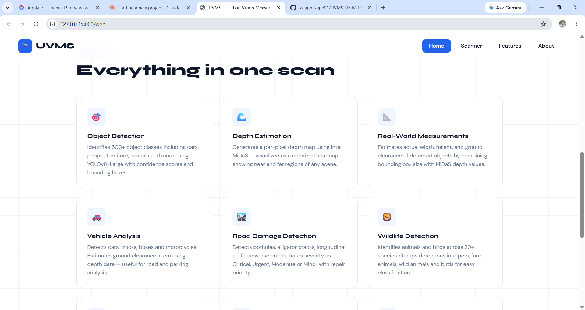

# 🏙️ UVMS — Urban Vision Measurement System

> **Everything in one scan** — A multi-purpose AI vision platform that analyzes 
> images using state-of-the-art computer vision models.


---

## 🚀 Live Demo
Run locally at: `http://127.0.0.1:8000/web`

---

## 🧠 What It Does — 6 AI Modules

| Module | Description |
|--------|-------------|
| 🎯 **Object Detection** | Detects 600+ objects (cars, people, furniture, animals) using YOLOv8-Large with confidence scores and bounding boxes |
| 🌊 **Depth Estimation** | Generates per-pixel depth map using Intel MiDaS — visualized as a colorized heatmap showing near/far regions |
| 📐 **Real-World Measurements** | Estimates actual width, height, and ground clearance by combining bounding box size with MiDaS depth values |
| 🚗 **Vehicle Analysis** | Detects cars, trucks, buses and motorcycles. Estimates ground clearance in cm using depth data |
| 🛣️ **Road Damage Detection** | Detects potholes, alligator cracks, longitudinal and transverse cracks. Rates severity as Critical / Urgent / Moderate / Minor |
| 🐾 **Wildlife Detection** | Identifies animals and birds across 20+ species. Groups into pets, farm animals, wild animals and birds |

---

## 🛠️ Tech Stack

- **Backend:** FastAPI + Uvicorn
- **Detection:** YOLOv8-Large (Ultralytics)
- **Depth:** Intel MiDaS (PyTorch Hub)
- **Building AI:** TensorFlow Hub SSD Model
- **Frontend:** HTML / CSS / JavaScript

---

## ⚙️ How to Run

```bash
# 1. Activate virtual environment
.venv\Scripts\activate

# 2. Start the server
uvicorn main:app --host 0.0.0.0 --port 8000

# 3. Open in browser
http://127.0.0.1:8000/web
```

---

## 📁 Project Structure
UVMS-UNIVERSAL SYSTEM/

├── main.py                  # FastAPI app entry point

├── models/

│   ├── detector.py          # YOLOv8 multi-detector

│   ├── depth.py             # MiDaS depth estimator

│   ├── building_detector.py # TF Hub building model

│   ├── road_damage.py       # Pothole & crack detector

│   └── wildlife.py          # Wildlife classifier

├── routes/

│   ├── building.py

│   ├── furniture.py

│   └── waste.py

├── templates/

│   ├── index.html

│   └── app1.html

└── utils/

└── image.py



